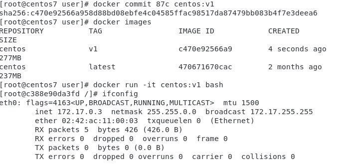

### 2020/3/25


### CentOS 7 自建 SSL 憑證
實作參考 https://www.brilliantcode.net/343/centos-7-create-own-ssl-certificates/

**錯誤勘正:**
step:4
```
openssl x509 -req -days 3650 -in ca.csr -signkey ca.key -out ca.crt
```
ca.key 前要空格


### docker
docker ps -a   可顯示已知的docker ps  
docker exec -it 目前容器ID ls  /路徑(給容器放的位置) 
docker commit ID user/套件:v2  凍結套件



https://hub.docker.com/

docker pull httpd:2.4.41

cd /tmp

docker run -dit --name my-apache-app -p 8080:80 -v "$PWD":/usr/local/apache2/htdocs/ httpd:2.4.41

echo "hi" > hi.htm

http://127.0.0.1:8080/hi.htm

