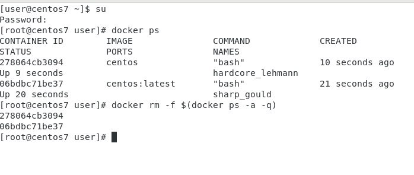
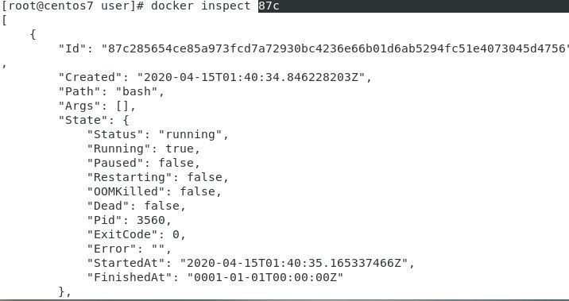
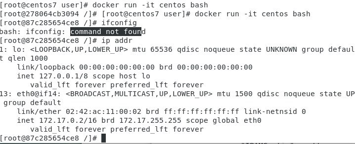
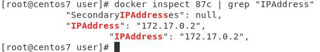

### 20200/4/15

```
docker run -it centos echo “hi”   
```
參數it 指與image互動  
d指在背後執行 detach  
通常在設定的時候會將tag 設定為定值  
因為每次上線他會去線上檢查版本若有最新版會自動下載  
容器指執行單一的工作若無工作則容器消滅  

```
docker rm CID  
```
若容器存在時移除不用加-f


刪除所有container
docker rm -f $(docker ps -a -q) 
>

docker inspect CID 檢視container內容
>

docker run -it centos bash  
ip addr
>

docker ip
>


>
--name=web 讓這個container 命名為web   
–p指定port  
1234:80 指本機port 為1234 而容器內port 開80  
httpd 指要的服務 

製作image的方式   
>1)下載別人的,然後登入容器後,安裝做設置完後再產生新的image  
>2) Dockerfile


### 遠端同步

可參考  
[Linux 使用 rsync 遠端檔案同步與備份工具教學與範例](https://blog.gtwang.org/linux/rsync-local-remote-file-synchronization-commands/)

[关于 rsync 中: 和 :: 及 rysnc 和 ssh 认证协议的区别](https://cloud.tencent.com/developer/article/1043373)

[Linux运维：rsync+inotify实时同步](https://segmentfault.com/a/1190000018096553)


