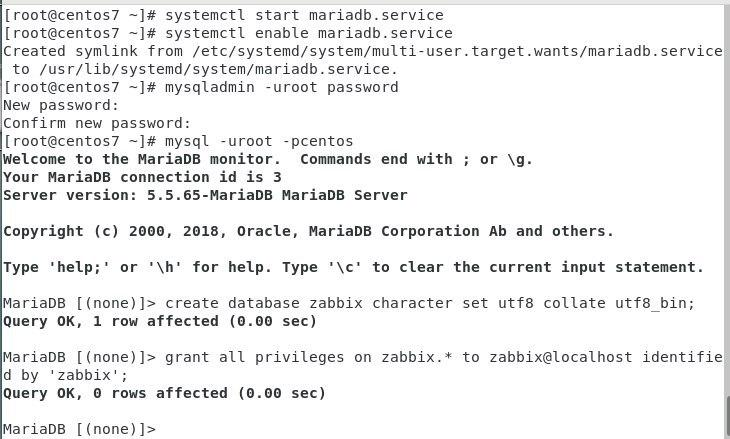

### 安裝zabbix

[CentOS 7安装部署Zabbix 4.4.1](http://www.hmjblog.com/network/7011.html)

**zabbix是甚麼呢?**
引用該博主的回答
>Zabbix是一个基于WEB界面的提供分布式系统监视以及网络监视功能的企业级的开源解决方案。  
Zabbix能监视各种网络参数，保证服务器系统的安全运营；并提供灵活的通知机制以让系统管理员快速定位/解决存在的各种问题。  
Zabbix由2部分构成，Zabbix server与可选组件Zabbix agent。  
Zabbix server可以通过SNMP，zabbix agent，ping，端口监视等方法   提供对远程服务器/网络状态的监视，数据收集等功能，它可以运行在Linux，Solaris，HP-UX，AIX，Free BSD，Open BSD，OS X等平台上。


未完待續...


### 安裝mariadb
```
[root@centos02 ~]# yum -y install mariadb mariadb-server   <!--安装mariadb數據庫依賴-->
[root@centos02 ~]# systemctl start mariadb.service         <!--啟動服務-->
[root@centos02 ~]# systemctl enable mariadb.service
```
結果如下圖

